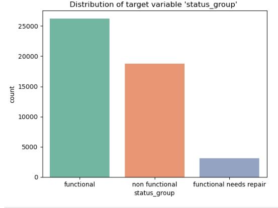
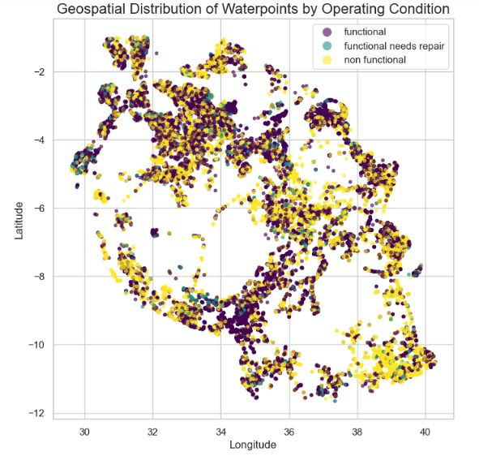
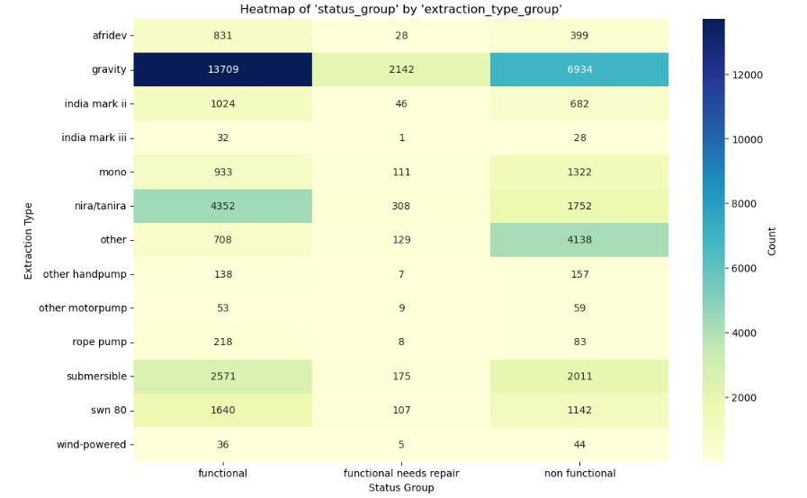
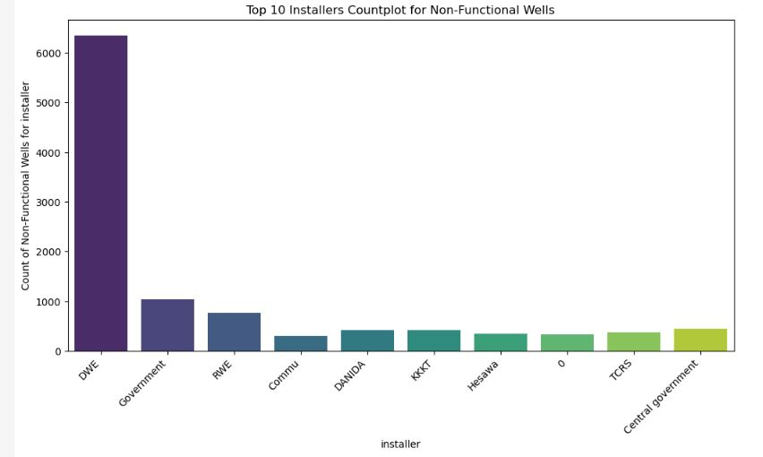

# Tanzania Water Well Project
## Introduction
This project aims to utilize machine learning and data visualization to predict the operating condition of a waterpoint for each record in the dataset, and to identify potential issues with existing water well projects, in order to promote access to clean, potable water across Tanzania.

## Problem Statement
While recognizing Tanzania's recent efforts to enhance clean water accessibility, the UN-Habitat acknowledges that a significant portion of the population still lacks safe water access. To address this, an initiative is being proposed to evaluate the distribution of wells in Tanzania and assess the functionality of water pumps in existing wells. The wells in Tanzania can be categorized as functional, non-functional, or in need of repair.

## Objectives

### Primary Objective:
- Deliver accurate predictions regarding the operational status of wells.

### Specific Objectives:
- Identify installers resulting in the most nonfunctional waterpoint pumps.
- Determine how extraction type influences operational status of a water pump
- Identify where most non-functional water pumps are located in Tanzania.
- Identify the proportions of functional, non-functional and pumps in need of repair

## Data Source
The data used in this analysis was provided by Taarifa Tanzania, and downloaded from *Driven Data* Website.
The target Variable is **status_group**, which is a categorical class indicating whether a well is functional, non-functional or in need of repair:
- functional: The waterpoint is operational, and no repairs are needed.
- functional needs repair: The waterpoint is operational but needs repairs.
- non-functional: The waterpoint is not operational.

## Data Understanding
The following set of information was provided about the waterpoints:

- amount_tsh - Total static head (amount water available to waterpoint)
- date_recorded - The date the row was entered
- funder - Who funded the well
- gps_height - Altitude of the well
- installer - Organization that installed the well
- longitude - GPS coordinate
- latitude - GPS coordinate
- wpt_name - Name of the waterpoint if there is one
- basin - Geographic water basin
- subvillage - Geographic location
- region - Geographic location
- region_code - Geographic location (coded)
- district_code - Geographic location (coded)
- lga - Geographic location
- ward - Geographic location
- population - Population around the well
- public_meeting - True/False
- recorded_by - Group entering this row of data
- scheme_management - Who operates the waterpoint
- scheme_name - Who operates the waterpoint
- permit - If the waterpoint is permitted
- construction_year - Year the waterpoint was constructed
- extraction_type - The kind of extraction the waterpoint uses
- extraction_type_group - The kind of extraction the waterpoint uses
- extraction_type_class - The kind of extraction the waterpoint uses
- management - How the waterpoint is managed
- management_group - How the waterpoint is managed
- payment - What the water costs
- payment_type - What the water costs
- water_quality - The quality of the water
- quality_group - The quality of the water
- quantity - The quantity of water
- quantity_group - The quantity of water
- source - The source of the water
- source_type - The source of the water
- source_class - The source of the water
- waterpoint_type - The kind of waterpoint
- waterpoint_type_group - The kind of waterpoint

## Exploratory Data Analysis (EDA) Insights

- 54.6% of the water points provide access to clean water
- 39.0% of the water points are not operational
- 6.4% of the water points need repair

Clusters of yellow and teal points indicate regions where water infrastructure might be failing or in need of urgent attention.

Largest group of functional waterpoints uses gravity-fed systems (13709), but there is also a significant number of non-functional systems (6934).

## Classification Models
Several Classification Models were employed for this Analysis:

Logistic Regression
- Train Accuracy - 64.54%
- Test Accuracy - 64.02%

Decision Trees
- Train Accuracy - 80.05%
- Test Accuracy - 67.75%
 
Random Forest
- Training Accuracy - 93.20%
- Testing Accuracy - 77.22%
- 
These results highlight the model's ability to learn from the training data effectively while still generalizing well to new, unseen data. 
 

## Conclusions
### Rationale

The **Random Forest Classifier** was selected as the top-performing model for this classification task due to its ability to effectively balance complexity and generalization. The model was trained and evaluated on a dataset where the goal was to accurately predict the functional status of waterpoints.

### Results

Training Accuracy: 93.20%
Test Accuracy: 77.22%

These results highlight the model's ability to learn from the training data effectively while still generalizing well to new, unseen data. The 77.22% test accuracy suggests that the model performs well in practical scenarios, meaning it is likely to correctly predict the operational status of a waterpoint about 77% of the time when applied to new data.

### Limitations
Despite the relatively high accuracy, the model's performance shows a noticeable drop from training to test accuracy (from 93.20% to 77.22%), indicating some level of model complexity that may still be capturing noise in the training data. Additionally, a test accuracy of 77.22% implies that there is still a significant proportion (22.78%) of predictions that could be incorrect. This level of accuracy might not be sufficient for critical applications where higher precision is required, such as targeting maintenance resources in regions with severe water scarcity.

Another limitation is that while accuracy is a useful metric, it does not account for potential imbalances in the dataset. For instance, if the dataset has more functional than non-functional waterpoints, accuracy alone may not fully reflect the model's effectiveness in predicting each class equally well. Other evaluation metrics like precision, recall, and the F1-score should be considered for a more comprehensive assessment of the model's performance.

## Recommendations
1. **Refinement of the Model:** Consider further tuning of the Random Forest's hyperparameters, such as the number of trees, depth of trees, and feature selection, to see if slight adjustments can improve test accuracy without increasing overfitting.
2. **Alternative Evaluation Metrics:** Evaluate the model using additional metrics like precision, recall, F1-score, and confusion matrices, especially if the classes are imbalanced. This will provide a better understanding of how well the model distinguishes between functional and non-functional waterpoints.
3. **Ensemble Methods:** Explore other ensemble methods or hybrid models, such as Gradient Boosting or a combination of Random Forest with another model, to see if they can achieve better generalization and higher accuracy.
4. **Data Augmentation:** Consider augmenting the data, especially for underrepresented classes, to help the model learn better and improve its performance on the test set.
5. **Periodic Retraining:** Since the conditions affecting waterpoints can change over time, it's recommended to periodically retrain the model with new data to ensure it remains accurate and relevant in predicting the current status of waterpoints.
